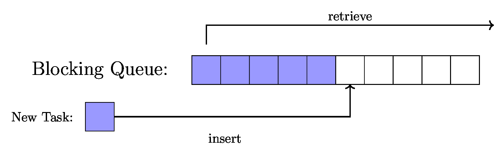
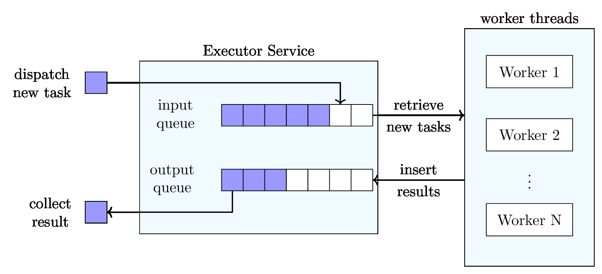

# Task #1: Assignment Description

This task allows you to gain hands-on experience on parallelization and synchronization in Java by implementing your own blocking queue and executor service.

The task consists of four subtasks which are explained in more detail below:

* Blocking queue: You will implement a blocking queue that is later used by your executor service to store new tasks and results for the worker threads.
* Executor service: You will design an executor-service framework that handles a pool of worker threads without requiring manual intervention.
* Log-file analyzer: You will program the processing logic for a parallel application, namely an analyzer that counts the occurrence of specific entries in a set of log files.
* Evaluation: Finally, you will run an experiment using your executor service and log-file analyzer to assess the performance benefits enabled by parallelization.

> All code for this task is to be implemented in the **package** `dsg.executor`.
> For most required classes and methods you find **skeleton classes in your GitLab group repository**.

## 1.1 Blocking Queue

Implement your own blocking queue in the class `DSGBlockingQueue`. The queue's elements are added and removed according to **first-in-first-out (FIFO)** semantics.



### Implementation

```java
public class DSGBlockingQueue<V> {
    public void insert(V value);
    public V retrieve() throws InterruptedException;
    public int size();
}
```

The queue supports storing elements of an arbitrary data type `<V>` which is why `DSGBlockingQueue` is a generic class. Since the queue later will be used by multiple threads, make sure that **its operations are thread-safe**.

Once initialized, the queue accepts new values with the `insert()` method, which adds a new element to the end of the queue. This method is to be implemented in a non-blocking way – appending a new element should always be possible, independent of the current state of the queue.

Removing an element from the queue is done by `retrieve()`. This method removes the first element from the queue and is to be implemented in a blocking way. This means that if the queue is currently empty, the method will block until it can retrieve an element from the queue.

Finally, the `size()` method returns the number of elements currently stored in the queue.

### Task Checklist

* Implement the class `DSGBlockingQueue`

> The goal of this task is to develop a blocking queue from scratch using only the most basic Java functionality (e.g., primitive data types, references, arrays,...). Hence, for your implementation you are **not allowed to use any existing complex Java data structures (e.g., lists, queues, maps,...)**. If you are in doubt whether a specific means is permitted or not, please do not hesitate to ask your advisors.

## 1.2 Executor Service

Implement your own executor-service framework in the class `DSGExecutorService`. The executor service is responsible for managing worker threads as well as keeping track of both pending and completed tasks.



### Tasks

```java
public interface DSGTask {
    public void execute();
}
```

All tasks supported by the executor service implement the interface `DSGTask` and its method `execute()`. From the executor service's perspective, the specific implementation of a task's `execute()` is of no relevance. To process a task, an executor-service thread simply invokes `execute()` and waits until the method runs to completion.

### Implementation

```java
public class DSGExecutorService {
    // Constructor
    public DSGExecutorService(int threads);

    // Operations
    public void dispatch(DSGTask task);
    public DSGTask collect();
    public void shutdown() throws InterruptedException;
}
```

To initialize the executor service, the `DSGExecutorService()` constructor receives a parameter **threads** that specifies the number of worker threads to manage.

Internally, the executor service comprises **two blocking queues** – one input queue storing pending tasks that have been submitted by users for execution, and one output queue in which the executor service inserts tasks after they have been processed. Use your `DSGBlockingQueue` implementation for both of them. It is up to you to decide which strategy your executor service uses to assign tasks to worker threads; the only requirement in this context is that worker threads should only idle if the input queue is empty.

The `dispatch()` method enables users to append tasks to the input queue.

Completed tasks can be obtained with the method `collect()`, which blocks until such a task can be retrieved and returned from the output queue. If the caller of `collect()` is interrupted while waiting for a finished task, or the executor service shut down and has no more completed tasks to provide, the method returns `null`.

An invocation of `shutdown()` terminates the executor service and its worker threads. This method blocks until all previously submitted tasks have been processed and no more worker threads are running.

### Task Checklist

Implement the class `DSGExecutorService` by using your `DSGBlockingQueue` implementation

> To have full control over the inner workings of your executor service, **your implementation must not rely on classes related to Java's own executor service (e.g., `java.util.concurrent.Executor`)**. If you are in doubt whether the use of a specific class is permitted or not, please do not hesitate to ask your advisors.

## 1.3 Log-File Analyzer

A typical use case that benefits from parallelization is the analysis of log files. In practice, these kinds of files can become quite large, and consequently processing them often times requires a significant amount of computing resources. Fortunately, due to log files usually being independent of each other, the analyses of different files may be performed concurrently in separate threads, for example using frameworks such as the `DSGExecutorService`.

## Log Files

The log files to examine as part of this task all have a common structure. Specifically, each file comprises a sequence of log entries, which are represented as **individual text lines** of the following format:

`<Type> <Message>`

Each line starts with the `<Type>` of the log entry (which is either `INFO`, `WARN` or `ERROR`), followed by a space and the actual log message `<Message>`; this message itself may contain additional spaces.

### Log-File Generator

For your convenience, the assignment material includes the Java-based `DSGLogFileGenerator` tool that allows you to create log files with predefined characteristics. It can be used as follows:

```bash
java -cp <classpath> dsg.executor.DSGLogFileGenerator <num_files> <num_info> <num_warn> <num_error>
```

For example, starting the program with

```bash
java -cp <classpath> dsg.executor.DSGLogFileGenerator 5 170 45 27
```

will create 5 log files with a total of 170 `INFO` entries, 45 `WARN` entries and 27 `ERROR` entries. How the log entries are distributed in the various log files is chosen at random; however, the same parameters will always result in the same log files.

> To avoid inconsistencies, it is recommended to (manually) **delete all old log files before generating new ones**.

### Analyzer Task

The main purpose of the analyzer is to count the number of occurrences of a specific log-entry type within a file. The analyzer's logic is represented by a task called `DSGLogCounter`:

```java
public class DSGLogCounter implements DSGTask {
    // Constructor
    public DSGLogCounter(String filepath, DSGLogType type);
  
    // Operations
    public void execute();
    public int getResult();
    public DSGLogType getType();
}
```

On initialization, the `DSGLogCounter()` constructor receives a **filepath** pointing to the log file to analyze, as well as a parameter **type** specifying which category of log entries to count. The actual counting is performed inside `DSGTask`'s `execute()` method. Once the task is finished, the determined number of log-entry occurrences can be retrieved by calling the `getResult()` method. Furthermore, for testing purposes, the analyzer also offers a `getType()` method returning the `DSGLogType` that the task was instructed to count.

### Task Checklist

* Implement the class `DSGLogCounter`

## 1.4 Evaluation

Having completed the executor-service and analyzer-task implementations, in a last step use both of them to explore under which conditions processing tasks in parallel actually leads to performance benefits. For this purpose, first generate a set of large log files and then measure the time it takes to analyze them using different numbers of worker threads.

### Preparation

To produce inputs for the experiment, use the DSGLogFileGenerator to create 100 log files with a total of:

* 20,000,000 INFO entries
* 10,000,000 WARN entries
* 10,000,000 ERROR entries

> The log files for this evaluation in total are about 1 GB in size. Please make sure to not upload them to your GitLab repository.

### Experiment

Include all functionality required for conducting the experiment in a class `DSGLogBenchmark`. As part of the experiment, the benchmark should be executed multiple times. Each benchmark run consists of a full `DSGLogCounter` analysis of all 100 generated log files in which the number of `INFO` log entries is counted. In order to assess the performance implications of different configurations, have `DSGLogBenchmark` measure **the execution time of each run** from start to finish.

To obtain comprehensive results, make sure that the experiment includes benchmark runs with all possible `DSGExecutorService` thread-pool sizes **in the range between 1 and 16 threads**. Furthermore, **for each thread-pool size repeat the benchmark 5 times**, and have `DSGLogBenchmark` report the average value of these runs as overall result for this scenario. For better comparability, **compile the gathered results into a graph** (e.g., a bar chart) that shows the relation between the number of threads (on the horizontal axis) and the corresponding execution-time average (on the vertical axis).

### Task Checklist

* Generate the requested log files using the `DSGLogFileGenerator` tool
* Implement the experiment based on your `DSGExecutorService` and `DSGLogCounter` implementations in a class `DSGLogBenchmark`
* Run the experiment and compile its results into a graph
* Store the graph as a PDF file in your GitLab group repository under the path `evaluation/task1.pdf`
